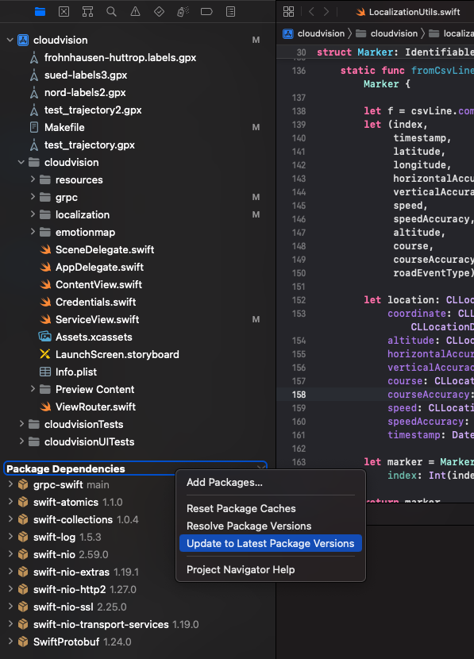
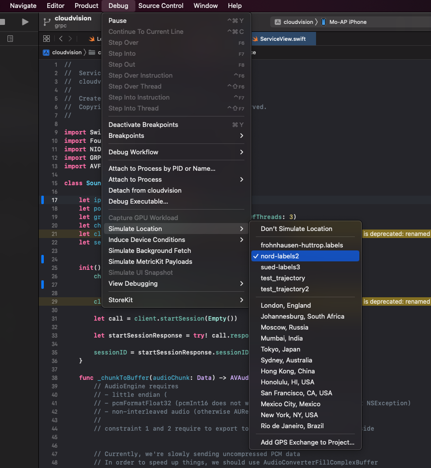
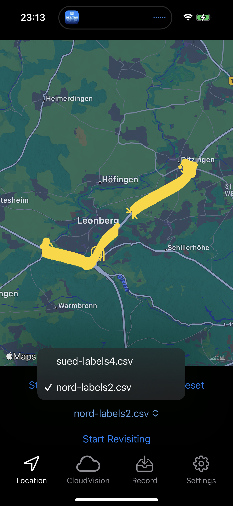
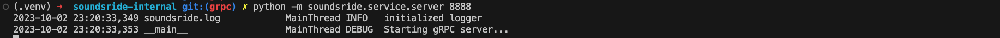
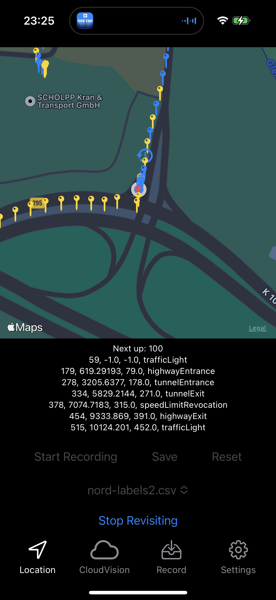
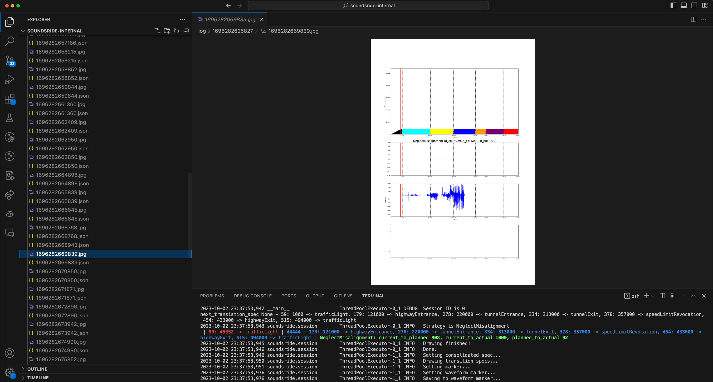

# SoundsRide: Affordance-Synchronized Music Mixing for In-Car Audio Augmented Reality [Client]

[Mohamed Kari<sup>1,2</sup>](https://mkari.de/), [Tobias Grosse-Puppendahl<sup>1</sup>](http://grosse-puppendahl.com/), Alexander Jagaciak<sup>1</sup>, David Bethge<sup>1</sup>, Reinhard Schütte<sup>2</sup>, [Christian Holz<sup>3</sup>](https://www.christianholz.net)<br/>

<sup>1</sup> [Porsche AG](https://porsche.com/), Stuttgart, Germany <br/>
<sup>2</sup> University of Duisburg-Essen, Germany <br/>
<sup>3</sup> [Sensing, Interaction & Perception Lab](https://siplab.org), Department of Computer Science, ETH Zürich, Switzerland <br/>

---

SoundsRide runs the mixing server on MacOS and the localization client on iOS.
This repo contains the mixing server. 
For the mixing server, refer to [the server repo](https://github.com/MohamedKari/soundsride).

## Preparation
Open the localization client app in XCode and deploy it to the iPhone.

Because the dev iPhone is probably kept at a quite modern iOS version, we don't freeze the package dependencies. 
Instead, update all packages from the Project navigator side bar via right-click as shown below (running on iOS 16.7 and XCode 14.2) and potentially fix resulting problems:


## Development setup

### Step 1: generate the protobuffer code 
In the localization client repo, run
```sh
sudo xcode-select --switch /Applications/Xcode.app/Contents/Developer # uses the correct Swift compiler
make swift-protos # generates gRPC and protobuffer code in .grpc_build from the service spec
```

### Step 2: configure the server network endpoint
Insert the server's (i.e., the MacBook's) IP address and the service port in `soundsride/ServiceView.swift` in the corresponding `ip` and `port` constants.

### Step 3: deploy the app and copy the test trajectory to the iPhone
Build the app and deploy it to the iPhone via XCode.
XCode simulates the GPS trajectory indicated via the `Debug > Simulated Location` menu.

Go the location tab and hit `Start Recording`. 
Generally, this will record a trajectory and save it the on the user file space on the phone. 
Of course, this specific trajectory is useless, but this step also created the required folder structure on the iPhone. 

Go to the native `Files` app, to `On this iPhone`, to the `soundsride` app user data folder, into the `localization` subfolder.
Delete the useless trajectory that has just been created.
Now, deploy a provided trajectory, collected on the road, to the iPhone.
In particular, open the `data` folder in this repo, and send the `nord-labels2.csv` file to the phone via AirDrop. 
On the phone, use the `Files` app to save the annoated csv trajectory in `On this iPhone > soundsride > localication`.

Then, deploy the app again through XCode, after the app is running, choose `nord-labels2` from the `Debug > Simulate Location` menu.


Open the `soundsride` app again, go to the `Location` tab, choose the `nord-labels2.csv` trajectory from the dropdown menu.

<br/>



### Step 4: revisit
Make sure the server is running:


Finally, in the `Location` tab, hit `Start Revisiting`.

The iPhone will follow the simluated motion as indicated by `nord-labels2.gpx` in XCode.
It will predicat ETAs against the events in the annotated trajectory `nord-labels2.csv` chosen through the Location tab's dropdown menu.
(Of course, this behaves like an ideal case where the annotated trajectory used for ETA prediction and the real-time iPhone/vehicle motion are perfectly the same).

<br/>



The ETA predictions will be sent to the server which continuously performs the music mixing and resynchronization.
